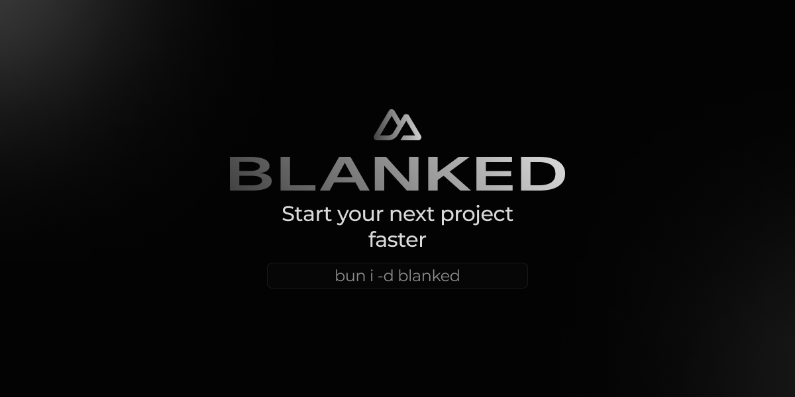

<p align="center">
  <a aria-label="NPM version" href="https://www.npmjs.com/package/blanked">
    
  </a>
  <a aria-label="License" href="https://github.com/HugoRCD/blanked/main/LICENSE">
    
    </a>
  <a aria-label="Follow Hugo on Twitter" href="https://twitter.com/HugoRCD__">
    
  </a>
</p>

Blanked is a Nuxt module to improve your Nuxt workflow. It's a simple module to add everything you need to your Nuxt app, including:
- TailwindCSS
- Color Mode, add a color mode switcher to your app (dark/light or custom)
- VueUse composables, add every composables from VueUse
- Icons, add every icons from your favorite icon pack (Heroicons and Lucide are pre-installed)
- Toasts, using the amazing [Vue Sonner](https://vue-sonner.vercel.app/) library

From
```json
{
  "name": "new-blanked-project",
  "private": true,
  "type": "module",
  "scripts": {
    "dev": "nuxi dev",
    "build": "nuxi build",
    "generate": "nuxi generate"
  },
  "devDependencies": {
    "nuxt": "latest",
    "@nuxtjs/color-mode": "latest",
    "@nuxtjs/tailwindcss": "latest",
    "@tailwindcss/aspect-ratio": "^0.4.2",
    "@tailwindcss/container-queries": "^0.1.1",
    "@tailwindcss/forms": "^0.5.7",
    "@tailwindcss/typography": "^0.5.10",
    "@egoist/tailwindcss-icons": "^1.7.2",
    "@iconify-json/heroicons": "^1.1.19",
    "@iconify-json/lucide": "^1.1.154",
    "tailwindcss": "^3.4.1",
    "nuxt-icon": "^0.6.8",
    "vue-sonner": "^1.0.3",
    "@vueuse/nuxt": "^1.0.0"
  }
}
```

To
```json
{
  "name": "new-blanked-project",
  "private": true,
  "type": "module",
  "scripts": {
    "dev": "nuxi dev",
    "build": "nuxi build",
    "generate": "nuxi generate"
  },
  "devDependencies": {
    "nuxt": "latest",
    "blanked": "latest"
  }
}
```

## Quick Setup

To get started, follow these steps:

1. Add `blanked` dependency to your project

```bash
# Using bun
bun install -D blanked

# Using pnpm
pnpm add -D blanked

# Using yarn
yarn add --dev blanked

# Using npm
npm install --save-dev blanked
```

2. Add `blanked` to the `modules` section of `nuxt.config.ts`

```js
export default defineNuxtConfig({
  modules: [
    'blanked'
  ]
})
```

Thanks to @egoist/tailwindcss-icons plugin, only the icons you use in your app will be bundled in your CSS. However, you need to install the icon collections you specified in the blanked.icons key:

```bash
bun i -D @iconify-json/{collection_name}
```

### Toasts

To use the toast component, you need to add the `<Toasts />` component in your app. You can add it in your `layouts/default.vue` or `app.vue` file for example.
To render the toasts, you need to use the `toast()` function.
For more information, check the [Vue Sonner](https://vue-sonner.vercel.app/) documentation.

That's it! You can now use Blanked in your Nuxt app ✨

## Authors

**Blanked Module**

- Hugo Richard ([@HugoRCD__](https://x.com/HugoRCD__))
- Johann Cavallucci ([@JohannCavallucci](https://github.com/cavalluccijohann))

## Thanks

This module is heavily inspired by the NuxtUI module, which embeds TailwindCSS, Color Mode and Icons in your Nuxt app. However, I wanted to make a module to start a Nuxt project without the components, etc...

